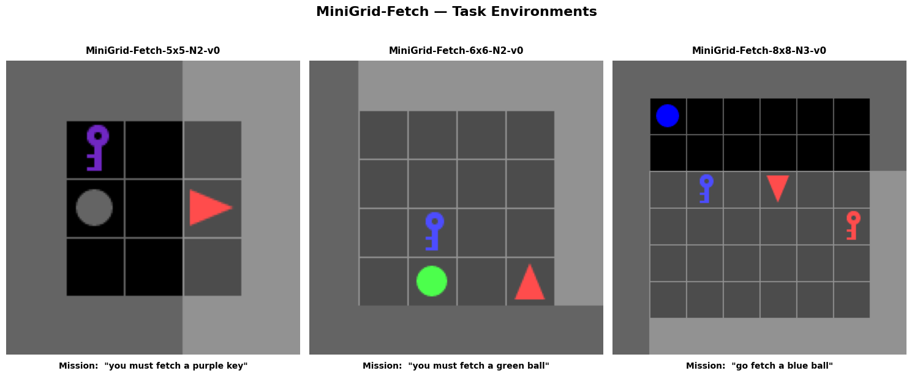
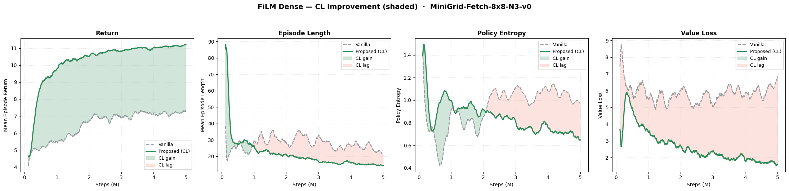
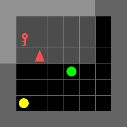
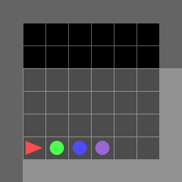

# Scalable Vision-Language Reinforcement Learning on MiniGrid-Fetch

Trains and compares four PPO-based agent variants on the **MiniGrid-Fetch** task across three grid sizes (5×5, 6×6, 8×8), with additional experiments in curriculum learning (CL) and imitation learning (IL).

---

## Task

The agent receives a partial (7×7 egocentric) RGB observation and a natural-language mission string (e.g. *"go fetch a blue ball"*). It must navigate the grid and pick up the target object within a fixed step budget.

---

## Variants

| Variant | Fusion | Memo + Text | Reward |
|---------|--------|-------------|--------|
| `baseline` | None | OFF | sparse |
| `memo_text` | Concat | ON | sparse |
| `film_dense` | FiLM ($\gamma \cdot x + \beta$) | ON | dense |
| `film_sparse` | FiLM ($\gamma \cdot x + \beta$) | ON | sparse |

**[FiLM](https://arxiv.org/abs/1709.07871)** (Feature-wise Linear Modulation) modulates CNN image features with GRU-encoded text, replacing simple concatenation with feature-wise affine transformations.

**Dense reward** adds a step penalty, first-sight bonus, approach shaping, and a success reward of +10.

---

## Repository Structure
```
├── config.yaml                   # Shared hyperparameters (PPO, reward, eval)
├── train_compare_5x5.ipynb       # Train all 4 variants on MiniGrid-Fetch-5x5-N2-v0
├── train_compare_6x6.ipynb       # Train all 4 variants on MiniGrid-Fetch-6x6-N2-v0
├── train_compare_8x8_CL.ipynb    # Train with curriculum learning (warm-start from 6×6)
├── train_compare_8x8_IL.ipynb    # Train with behavioural cloning pre-training
├── results_combined.ipynb        # Aggregate plots and post-CL agent visualisation
├── runs/                         # Training outputs
└── utils/
    ├── env.py                    # FetchDenseRewardWrapper, make_env, tokeniser
    ├── format.py                 # Observation preprocessor, Vocabulary
    ├── model_baseline.py         # Baseline ACModel (CNN + optional LSTM + concat)
    ├── model_film.py             # FiLM ACModel (CNN + BiGRU + FiLM + optional LSTM)
    └── plotting.py               # Training curves, episode recording, GIF export
```

---

## Quickstart
```bash
pip install -r requirements.txt
```

Open and run the notebooks in order:

1. `train_compare_5x5.ipynb`
2. `train_compare_6x6.ipynb`
3. `train_compare_8x8_CL.ipynb` (requires 6×6 checkpoints for CL warm-start)
4. `train_compare_8x8_IL.ipynb`
5. `results_combined.ipynb`

Hyperparameters are controlled via `config.yaml`.

---

## Results & Conclusion

### Environment

<p align="center">
  
</p>


### Curriculum Learning on 8×8

Warm-starting the `film_dense` agent from its 6×6 checkpoint and fine-tuning on 8×8 via curriculum learning achieved **100% success rate**.


<p align="center">
  
</p>

### Agent demo (8×8, `film_dense` after CL)

<table align="center">
  <tr>
    <td align="center"><em>"fetch the yellow ball"</em></td>
    <td align="center"><em>"fetch the green ball"</em></td>
  </tr>
  <tr>
    <td></td>
    <td></td>
  </tr>
</table>

### Summary

Across all grid sizes, **FiLM-based agents consistently outperform simple concatenation**, and dense reward shaping accelerates early learning. On the hardest 8×8 setting, direct training leaves all variants below 100% success; curriculum learning (5×5 → 6×6 → 8×8) closes that gap, enabling `film_dense` to reach **100% task completion** by re-using transferable visual-language representations learned on smaller grids.

---

## Acknowledgements

This project builds on the [MiniGrid](https://github.com/Farama-Foundation/Minigrid) environment library maintained by the Farama Foundation. The FiLM conditioning approach is based on Perez et al. (2018).

### Citations
```bibtex
@inproceedings{MinigridMiniworld23,
  author       = {Maxime Chevalier{-}Boisvert and Bolun Dai and Mark Towers and Rodrigo Perez{-}Vicente and Lucas Willems and Salem Lahlou and Suman Pal and Pablo Samuel Castro and Jordan Terry},
  title        = {Minigrid {\&} Miniworld: Modular {\&} Customizable Reinforcement Learning Environments for Goal-Oriented Tasks},
  booktitle    = {Advances in Neural Information Processing Systems 36, New Orleans, LA, USA},
  month        = {December},
  year         = {2023},
}

@inproceedings{perez2018film,
  title={Film: Visual reasoning with a general conditioning layer},
  author={Perez, Ethan and Strub, Florian and De Vries, Harm and Dumoulin, Vincent and Courville, Aaron},
  booktitle={Proceedings of the AAAI conference on artificial intelligence},
  volume={32},
  number={1},
  year={2018}
}
```

---

## License

[MIT](LICENSE)